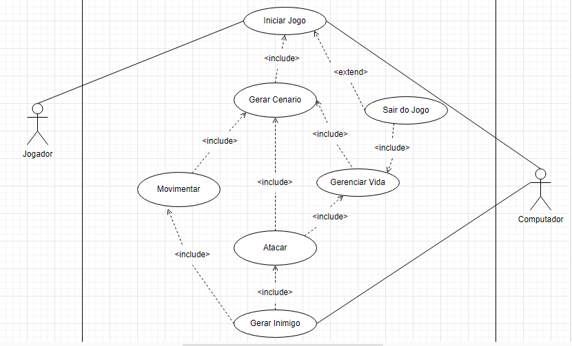
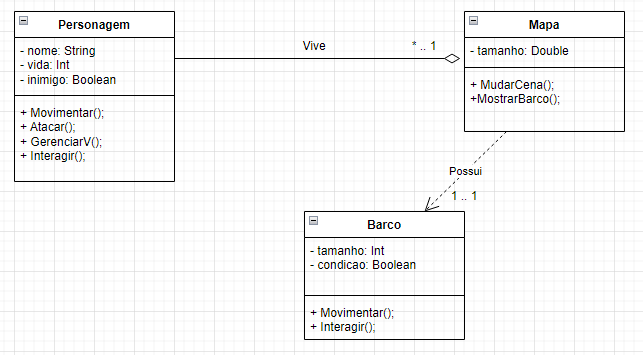
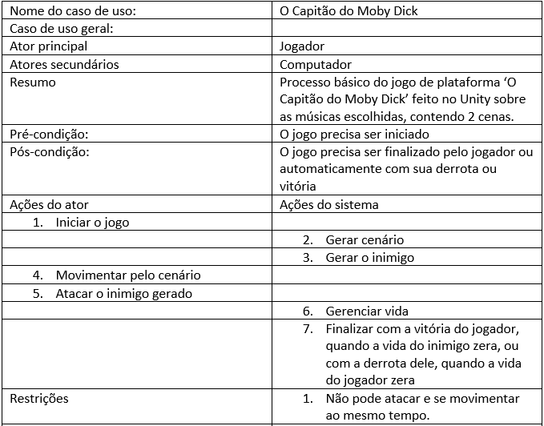
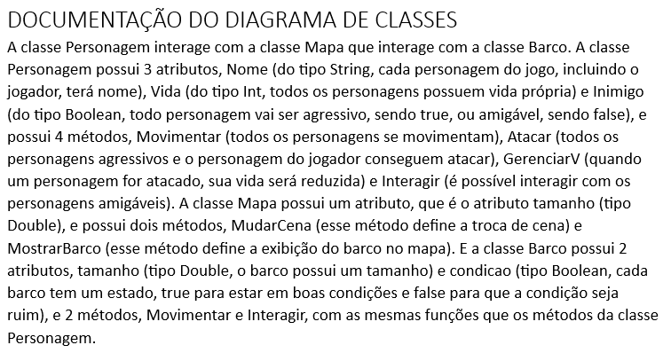

# README DA ATIVIDADE DE LP DAS MÚSICAS
README do jogo feito com a ferramenta Unity para a matéria de Linguagem de Programação, onde foram escolhidos duas músicas e fazer duas cenas baseada em ambas.
## COMO É O JOGO?
O jogo é 3D mas com a jogabilidade de um jogo de plataforma, onde se movimenta o personagem apenas para cima e para baixo. O jogo conta a história de um capitão que perdeu sua tripulação por causa
## MÚSICAS ESCOLHIDAS
O Limbo do Menino Sem Olhos e Moby Dick, ambas do cantor Kamaitachi.
## DOCUMENTAÇÃO E DIAGRAMA DE CASOS E DIAGRAMA DE CLASSES
Diagrama de Casos de Uso
 

Diagrama de Classe
 

Documentação do Caso de Uso
 

Documentação do Diagrama de Classes
 

## AUTORES
Kauan Jesus e Yuri Telis.